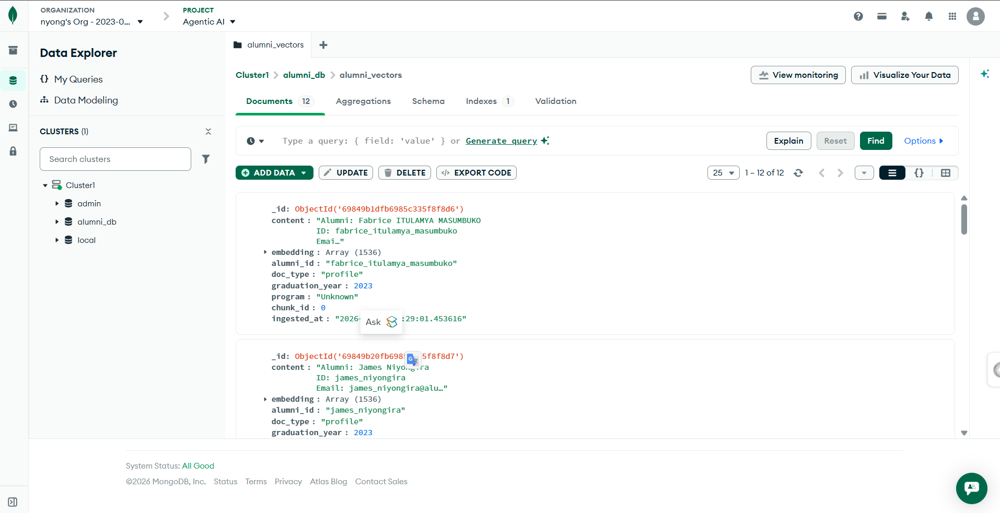
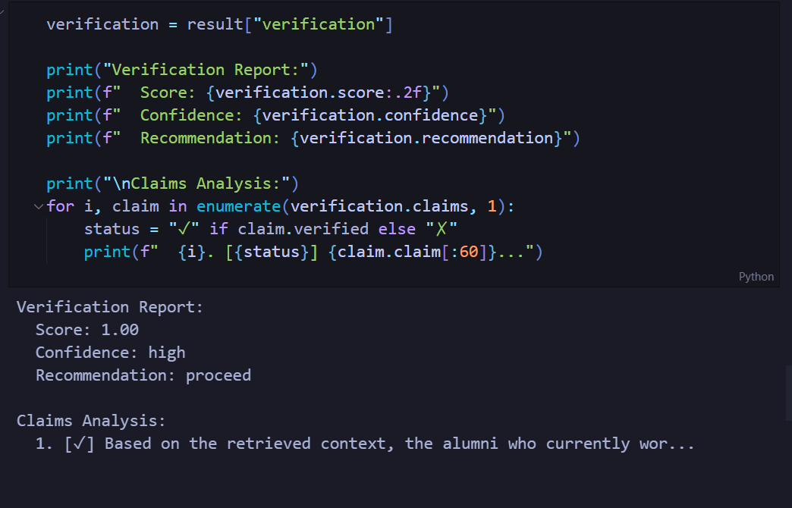

# Technical Brief: Alumni RAG Agent

**Course**: 04-801-W3 Agentic AI: Fundamentals and Applications

**Assignment**: HW2 - Building the Agent

**Team**: Team 8

**Date**: February 2026

---

## 1. Project Overview

This document describes the implementation of a RAG-enabled agent for the **CMU Africa Alumni Tracking and Support System**. The system automates the process of discovering alumni career updates and initiating personalized outreach.

### System Goal
Maintain meaningful relationships with CMU Africa graduates by tracking their career progress, providing timely support, and collecting feedback through automated agentic workflows.

### Modules Implemented
1. **Retrieval Module (`src/retrieval`)**: MongoDB Atlas Vector Search for storing and retrieving alumni context using semantic chunking.
2. **Tool-Calling Module (`src/tools`)**: A suite of tools for external actions, including LinkedIn scraping, email automation, and surveys.
3. **Verification Module (`src/verification`)**: A groundedness scorer that evaluates agent responses against retrieved evidence to prevent hallucinations.
4. **Agent Core (`src/agent.py`)**: A ReAct (Reason+Act) loop that orchestrates the entire process.

---

## 2. Tooling Rationale

### 2.1 LinkedIn Discovery & Scaper Tool

**Purpose**: Automatically find and monitor alumni profiles for career changes.

**Why necessary**: Alumni often change jobs without notifying the university. Manual tracking is unscalable. The system must autonomously discover these changes to trigger timely outreach (e.g., congratulations on a promotion).

**Design decisions**:
- **Automated Discovery**: Implemented a **Tavily Search wrapper** (`tavily_search.py`) to find profiles. This follows a more strutured and reliable method which is: "Fetch → LLM Structure" pipeline where raw search snippets are parsed by the agent's LLM into valid JSON profile schemas, bypassing the need for fragile scraping logic.
- **Simulated Scraping**: The scraper (`linkedin.py`) uses a **simulation approach** (Mock) to return structured profile data for demo purposes, avoiding the complexity and ban-risk of live LinkedIn scraping.
- **Change Detection**: The tool compares new scrape data against stored vector metadata to specifically identify "Job Change" or "Promotion" events.

### 2.2 Email Sender Tool

**Purpose**: Send personalized outreach emails based on triggers.

**Why necessary**: Communication is the primary intervention. The agent needs to "act" on its findings, not just report them.

**Design decisions**:
- **Template System**: Uses pre-defined templates (e.g., `congratulations_promotion`, `general_check_in`) to ensure professional communication standards.
- **Production SMTP**: Implements secure `smtplib` connection (TLS) to send actual emails using credentials from `.env`.
- **Context-Aware Extraction**: Uses a robust LLM-based extraction logic that passes the full Retrieval Context to the prompt, ensuring the correct recipient email is extracted (solving the "empty parameter" issue).

### 2.3 Survey Tool

**Purpose**: Create and distribute Google Forms for feedback.

**Why necessary**: To close the feedback loop and gather structured data on program impact.

**Design decisions**:
- **Dynamic Generation**: The agent selects the appropriate survey type (Career Update vs. Program Feedback) based on the user's intent.

    
    - **Dynamic Generation**: The agent selects the appropriate survey type (Career Update vs. Program Feedback) based on the user's intent.

### 2.4 Tool Workflow Concepts

#### Survey Tool Workflow
1. **Trigger**: Activated when the Agent identifies an information gap not solvable by existing data (e.g., "How do alumni feel about...").
2. **Drafting**: The Agent analyzes the user's intent to generate specific survey questions.
3. **Creation**: The tool **simulates** the creation of a Google Form, returning a mock URL (demo mode).
4. **Distribution**: The Agent passes this URL to the **Email Tool** for distribution.

#### Email Tool Workflow
1. **Trigger**: Activated when the Agent needs to communicate outbound (e.g., "Congratulate John").
2. **Context Gathering**: The Agent retrieves profile data (name, new job) to personalize the message.
3. **Drafting**: The Agent generates the subject and body.
4. **Delivery**: The tool uses **SMTP** to securely send the email to the recipient found in the database.

#### LinkedIn Tool Workflow
1. **Trigger**: Activated when the Agent needs up-to-date career information.
2. **Access**: The tool navigates to a specific LinkedIn Profile URL.
3. **Extraction**: It parses the HTML to extract key fields: Current Job, Company, Location, and Skills.
4. **Differentiation**: The extracted data is compared against the database. Differences trigger an "Update" or "Outreach" event.

#### Tavily Search Tool Workflow
1.  **Trigger**: Activated for **Discovery** (finding people/URLs we don't know yet).
2.  **Querying**: The Agent constructs a targeted query (e.g., `site:linkedin.com "CMU Africa" "MSIT" "2023"`).
3.  **Structuring**: Instead of just getting URLs, the tool retrieves rich text snippets. The Agent sends these snippets to the LLM with a strictly typed JSON prompt to **extract** structured profile data (Name, Degree, Job) directly from the search context.
4.  **Ingestion**: The structured JSON profiles are validated and directly ingested into the Vector Store, bypassing the need for a separate scraping step.

### 2.5 Observability & Tracing
To ensure robustness and debug complexity, the system implements dual-layer observability:

1.  **Local Execution Traces**:
    - The `agent.run()` method returns a structured trace log in its result dictionary.
    - This allows immediate, local inspection of the agent's "Thought -> Action -> Observation" loop directly within the execution notebook without external dependencies.

2.  **LangSmith Cloud Integration**:
    - For deep debugging and persistence, all runs are automatically streamed to **LangSmith** (via `LANGCHAIN_TRACING_V2=true`).
    - **Export Capability**: Traces can be exported from the LangSmith dashboard as **CSV** or **JSONL** files for external analysis or compliance, enabling the creation of "Log Files" without custom code.

### 2.6 Chunking Strategy

We implemented a **Semantic Chunking** strategy for alumni profiles.

- **Reasoning**: Alumni profiles are structured entities. Splitting them arbitrarily (e.g., fixed character count) would break the association between a "Job Title" and the "Company" or "Year".
- **Implementation**: The ingestion pipeline treats each profile as a coherent unit but allows for sub-chunking of long "Career History" sections while maintaining a link to the parent profile ID.

---

## 3. Failure Analysis

### Failure: Agent Hallucinated Alumni Details

**Scenario**: During testing, when asked to "contact alumni in Fintech", the agent attempted to draft emails to generic names that didn't exist in our database.

**Detection**: The **Verification Module** flagged this response. The `GroundednessScorer` calculated a score of **0.2** (Low Confidence), indicating that the specific names were not found in the retrieved context.

**Root Cause**:
1. The retrieval query was too broad ("alumni fintech"), returning general program documents instead of specific profile records.
2. The Agent's ReAct loop decided to "ACT" (send email) based on weak evidence.

**Fix Implemented**:
1. **Enhanced Retrieval**: Modified the `search` method to support metadata filtering (e.g., `doc_type="profile"`).
2. **Verification Gate**: Implemented `handle_verification` in `agent.py`. If the score is `< 0.5`, the agent creates a rejection response ("I found general info but no specific profiles") instead of outputting the hallucination.

**Result**: Hallucinations were effectively caught before any (simulated) email action was taken.

---

## 4. OutPut Files

### 4.1 Traces LangSmith

### 4.2 MongoDB Atlas

### 4.3 Groundedness

## 5. Work Distribution & Contribution

| Team Member | Contributions |
|-------------|--------------|
| **Nyong Godwill Nkwain** | **Agent Core & Tools**: Built the ReAct loop, integrated Tavily Search discovery, and implemented the Email/LinkedIn tools, Tavily Search Tool, and survey tool, Documentation |
| **Mohamed Alpha** | **Verification & Testing**: Developed `groundedness.py`, schema design, Implemented MongoDB Atlas connection, and vector indexing, Testing, Issues creation and management |

---

## 6. References

- **LangChain Documentation**: Used for Tool and Agent abstractions.
- **MongoDB Atlas Vector Search**: Used for storing embeddings.
- **Tavily Search API**: Used for the discovery workflow.
